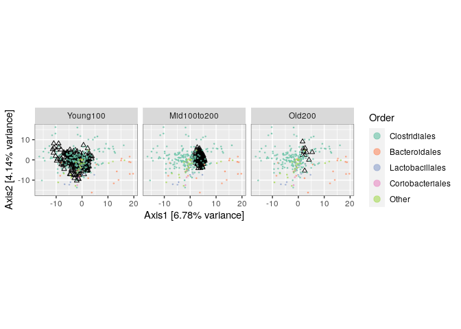

R phyloseq
================

  - [1- Importation des métadonnées pour
    l’analyse](#importation-des-métadonnées-pour-lanalyse)
  - [2- Filtration](#filtration)
      - [a) Filtration taxonomique](#a-filtration-taxonomique)
      - [b) Filtration de la prévalence](#b-filtration-de-la-prévalence)
  - [3- Agglomération des données](#agglomération-des-données)
  - [4-transformation des valeurs
    d’abondance.](#transformation-des-valeurs-dabondance.)
  - [5- Sous-ensemble par taxonomie](#sous-ensemble-par-taxonomie)
      - [Processing](#processing)
  - [6- Enseignement supervisé](#enseignement-supervisé)
  - [7- Analyses basées sur les
    graphes](#analyses-basées-sur-les-graphes)
      - [a) Création des graphes](#a-création-des-graphes)
      - [b)Tests à deux échantillons basés sur des
        graphiques](#btests-à-deux-échantillons-basés-sur-des-graphiques)
      - [c) modélisation linéaire](#c-modélisation-linéaire)
      - [d)Tests multiples
        hiérarchiques](#dtests-multiples-hiérarchiques)
  - [8- Techniques multitables](#techniques-multitables)
  - [CONCLUSION](#conclusion)

``` r
library(rmarkdown)
library(knitr)
```

\#Ce code a pour bute de lier les données DADA2 à Phyloseq (C’est la
continuité du dernier code du script DADA2)

``` r
load("~/phyloseq_tuto/02_dada-analysist")
```

\#Chargement des packages nécessaires pour les analyses.

``` r
packageVersion("phyloseq")
```

    ## [1] '1.32.0'

``` r
library(phyloseq)
```

``` r
library(ggplot2)
```

``` r
library(Biostrings)
```

    ## Loading required package: BiocGenerics

    ## Loading required package: parallel

    ## 
    ## Attaching package: 'BiocGenerics'

    ## The following objects are masked from 'package:parallel':
    ## 
    ##     clusterApply, clusterApplyLB, clusterCall, clusterEvalQ,
    ##     clusterExport, clusterMap, parApply, parCapply, parLapply,
    ##     parLapplyLB, parRapply, parSapply, parSapplyLB

    ## The following objects are masked from 'package:stats':
    ## 
    ##     IQR, mad, sd, var, xtabs

    ## The following objects are masked from 'package:base':
    ## 
    ##     anyDuplicated, append, as.data.frame, basename, cbind, colnames,
    ##     dirname, do.call, duplicated, eval, evalq, Filter, Find, get, grep,
    ##     grepl, intersect, is.unsorted, lapply, Map, mapply, match, mget,
    ##     order, paste, pmax, pmax.int, pmin, pmin.int, Position, rank,
    ##     rbind, Reduce, rownames, sapply, setdiff, sort, table, tapply,
    ##     union, unique, unsplit, which, which.max, which.min

    ## Loading required package: S4Vectors

    ## Loading required package: stats4

    ## 
    ## Attaching package: 'S4Vectors'

    ## The following object is masked from 'package:base':
    ## 
    ##     expand.grid

    ## Loading required package: IRanges

    ## 
    ## Attaching package: 'IRanges'

    ## The following object is masked from 'package:phyloseq':
    ## 
    ##     distance

    ## Loading required package: XVector

    ## 
    ## Attaching package: 'Biostrings'

    ## The following object is masked from 'package:base':
    ## 
    ##     strsplit

\#Ce code a pour but d’ajouter une nouvelle table avec l’objet qui va
permettre plus tard la construction de l’arbre phylogénétique

``` r
library(phangorn)
```

    ## Loading required package: ape

    ## 
    ## Attaching package: 'ape'

    ## The following object is masked from 'package:Biostrings':
    ## 
    ##     complement

``` r
library(DECIPHER)
```

    ## Loading required package: RSQLite

``` r
library(dada2)
```

    ## Loading required package: Rcpp

``` r
seqs <- getSequences(seqtab.nochim)
names(seqs) <- seqs # This propagates to the tip labels of the tree
alignment <- AlignSeqs(DNAStringSet(seqs), anchor=NA,verbose=FALSE)
phangAlign <- phyDat(as(alignment, "matrix"), type="DNA")
dm <- dist.ml(phangAlign)
treeNJ <- NJ(dm) # Note, tip order != sequence order
fit = pml(treeNJ, data=phangAlign)
```

    ## negative edges length changed to 0!

``` r
fitGTR <- update(fit, k=4, inv=0.2)
fitGTR <- optim.pml(fitGTR, model="GTR", optInv=TRUE, optGamma=TRUE,
        rearrangement = "stochastic", control = pml.control(trace = 0))
detach("package:phangorn", unload=TRUE)
```

# 1- Importation des métadonnées pour l’analyse

``` r
ps_connect <-url("https://raw.githubusercontent.com/spholmes/F1000_workflow/master/data/ps.rds")
ps = readRDS(ps_connect)
ps
```

    ## phyloseq-class experiment-level object
    ## otu_table()   OTU Table:         [ 389 taxa and 360 samples ]
    ## sample_data() Sample Data:       [ 360 samples by 14 sample variables ]
    ## tax_table()   Taxonomy Table:    [ 389 taxa by 6 taxonomic ranks ]
    ## phy_tree()    Phylogenetic Tree: [ 389 tips and 387 internal nodes ]

# 2- Filtration

## a) Filtration taxonomique

\#Ici une table est crée avec le nombre d’échantillons correspondant à
chaque phylums, en plus des échantillons non classés (NA). Ils sont 6 au
total.

``` r
library("phyloseq")
rank_names(ps)
```

    ## [1] "Kingdom" "Phylum"  "Class"   "Order"   "Family"  "Genus"

``` r
table(tax_table(ps)[, "Phylum"], exclude = NULL)
```

    ## 
    ##              Actinobacteria               Bacteroidetes 
    ##                          13                          23 
    ## Candidatus_Saccharibacteria   Cyanobacteria/Chloroplast 
    ##                           1                           4 
    ##         Deinococcus-Thermus                  Firmicutes 
    ##                           1                         327 
    ##                Fusobacteria              Proteobacteria 
    ##                           1                          11 
    ##                 Tenericutes             Verrucomicrobia 
    ##                           1                           1 
    ##                        <NA> 
    ##                           6

\#Ici les echantillons non classés vont être supprimés.

``` r
ps <- subset_taxa(ps, !is.na(Phylum) & !Phylum %in% c("", "uncharacterized"))
```

\#Ensuite la prévalence de chaque échantillon est calculée et ensuite
enregistrée sous forme de data.frame

``` r
prevdf = apply(X = otu_table(ps),
               MARGIN = ifelse(taxa_are_rows(ps), yes = 1, no = 2),
               FUN = function(x){sum(x > 0)})
```

\#Puis les taxas et le nombre total des reads est ajouté à ce data.frame

``` r
prevdf = data.frame(Prevalence = prevdf,
                    TotalAbundance = taxa_sums(ps),
                    tax_table(ps))
```

\#Ensuite, et à l’aide de la fonction cbind, on va créer une table pour
représenter les préalences qu’on vien de calculer, et comme çà on va
pouvoir detecter les échantillons les plus abondants et les echantillons
rares.

``` r
plyr::ddply(prevdf, "Phylum", function(df1){cbind(mean(df1$Prevalence),sum(df1$Prevalence))})
```

    ##                         Phylum         1     2
    ## 1               Actinobacteria 120.15385  1562
    ## 2                Bacteroidetes 265.52174  6107
    ## 3  Candidatus_Saccharibacteria 280.00000   280
    ## 4    Cyanobacteria/Chloroplast  64.25000   257
    ## 5          Deinococcus-Thermus  52.00000    52
    ## 6                   Firmicutes 179.24771 58614
    ## 7                 Fusobacteria   2.00000     2
    ## 8               Proteobacteria  59.09091   650
    ## 9                  Tenericutes 234.00000   234
    ## 10             Verrucomicrobia 104.00000   104

\#On remarque dans le tableau au dessus, que Deinococcus-Thermus
etFusobacteria apparaissent à peine dans 1% des echantillons. Ils
peuvent être du à une erreur de séquençage et donc il vaut mieux les
supprimer en utilisant le code suivant.

``` r
filterPhyla = c("Deinococcus-Thermus", "Fusobacteria")
```

\#Après cette filtration un nouvau objet ps1 est créer pour inclure les
modifications appliquées.

``` r
ps1 = subset_taxa(ps, !Phylum %in% filterPhyla)
ps1
```

    ## phyloseq-class experiment-level object
    ## otu_table()   OTU Table:         [ 381 taxa and 360 samples ]
    ## sample_data() Sample Data:       [ 360 samples by 14 sample variables ]
    ## tax_table()   Taxonomy Table:    [ 381 taxa by 6 taxonomic ranks ]
    ## phy_tree()    Phylogenetic Tree: [ 381 tips and 379 internal nodes ]

## b) Filtration de la prévalence

\#Les filtrations appliquées avant cette étape on été réalisé de façon
dépendante des bases de données. En revanche, la filtration de la
prévalence sera faite indépendamments de ces derniers, ça veut dire en
se basant sur l’analyse de nos propres données

\#Pour définir les paramètres de filtration des données, la relation
entre la prévalence et l’abondance totale doit être établie. Cela va
avoir pour but de détecter les valeurs abérantes et de la supprimer par
la suite. Sur les graphes ci-dessous chaque point est une séquence
appartenant à un phylum. On remarque que les firmicutes sont les plus
abondantes et que leurs prévalence augmente avec le temps.

``` r
library("ggplot2")
prevdf1 = subset(prevdf, Phylum %in% get_taxa_unique(ps1, "Phylum"))
ggplot(prevdf1, aes(TotalAbundance, Prevalence / nsamples(ps),color=Phylum)) +geom_hline(yintercept = 0.05, alpha = 0.5, linetype = 2) +  geom_point(size = 2, alpha = 0.7) +
  scale_x_log10() +  xlab("Total Abundance") + ylab("Prevalence [Frac. Samples]") +
  facet_wrap(~Phylum) + theme(legend.position="none")
```

<!-- -->
\#A partir des résultats obtenus, on peut alors définir un seul
classique de prévalence de 5% en utilisant le code suivant.

``` r
prevalenceThreshold = 0.05 * nsamples(ps)
prevalenceThreshold
```

    ## [1] 18

\#Appliquation du seuil défini

``` r
keepTaxa = rownames(prevdf1)[(prevdf1$Prevalence >= prevalenceThreshold)]
ps2 = prune_taxa(keepTaxa, ps)
```

# 3- Agglomération des données

\#Quand on est amené à analyser plusieurs données, il est souhaitable de
les regroupé ou les agglomérer selon des critères en commen partagés par
des bactéries proches. C’est ce qui va etre fait ici en utilisant
l’arbre phylogénétique qui va regrouper les espèces provonant du même
ancestre. Si les données ne sont pas suffisantes pour le faire, une
autre altérnative est de spécifier une hauteur d’arbre correspondant à
la distance phylogénétique entre les entités qui doivent définir leur
regroupement.

``` r
length(get_taxa_unique(ps2, taxonomic.rank = "Genus"))
```

    ## [1] 49

``` r
ps3 = tax_glom(ps2, "Genus", NArm = TRUE)
```

``` r
h1 = 0.4
ps4 = tip_glom(ps2, h = h1)
```

\#La fonction plot\_tree () de phyloseq compare les données originales
non filtrées, l’arbre après l’agglomération taxonoïque et l’arbre après
l’agglomération phylogénétique.

``` r
multiPlotTitleTextSize = 15
p2tree = plot_tree(ps2, method = "treeonly",
                   ladderize = "left",
                   title = "Before Agglomeration") +
  theme(plot.title = element_text(size = multiPlotTitleTextSize))
p3tree = plot_tree(ps3, method = "treeonly",
                   ladderize = "left", title = "By Genus") +
  theme(plot.title = element_text(size = multiPlotTitleTextSize))
p4tree = plot_tree(ps4, method = "treeonly",
                   ladderize = "left", title = "By Height") +
  theme(plot.title = element_text(size = multiPlotTitleTextSize))
```

\#Regroupement de l’ensemble des plots

``` r
library("gridExtra")
```

    ## 
    ## Attaching package: 'gridExtra'

    ## The following object is masked from 'package:BiocGenerics':
    ## 
    ##     combine

``` r
grid.arrange(nrow = 1, p2tree, p3tree, p4tree)
```

<!-- -->
\#Cette figure montre l’arbre d’origine à gauche, l’arbre après
l’agglomération taxonomique au rang du genre au milieu et puis
l’arbre après et l’agglomération phylogénétique à une distance fixe de
0,4 à droite.

# 4-transformation des valeurs d’abondance.

\#Cette étape vise à transformer les données d’abondance, à fin de tenir
en compte les différences de taille des bibliothèques, de variance etc…
Ceci est possible par le package Phyloseq en utiisant la fonction
transform\_sample\_counts(). \#Avec la fonction psmelt on va comparer
les différences d’échelles et de distribution des valeurs d’abondances
de l’objet phyloseq avant et après la transformation.

``` r
plot_abundance = function(physeq,title = "",
                          Facet = "Order", Color = "Phylum"){
  # Arbitrary subset, based on Phylum, for plotting
  p1f = subset_taxa(physeq, Phylum %in% c("Firmicutes"))
  mphyseq = psmelt(p1f)
  mphyseq <- subset(mphyseq, Abundance > 0)
  ggplot(data = mphyseq, mapping = aes_string(x = "sex",y = "Abundance",
                              color = Color, fill = Color)) +
    geom_violin(fill = NA) +
    geom_point(size = 1, alpha = 0.3,
               position = position_jitter(width = 0.3)) +
    facet_wrap(facets = Facet) + scale_y_log10()+
    theme(legend.position="none")
}
```

\#ici Le premier argument est l’objet qu’on veut transformer qui est ps3
et le deuxième est une fonction R et qui définit la transformation. La
transformation va être sauvé entant qu’objet qu’on va nommer ps3ra.

``` r
ps3ra = transform_sample_counts(ps3, function(x){x / sum(x)})
```

\#Ici on cherche à avoir la représentation graphique de l’abondance
avant et et après la transformation.

``` r
plotBefore = plot_abundance(ps3,"")
plotAfter = plot_abundance(ps3ra,"")
# Combine each plot into one graphic.
grid.arrange(nrow = 1,  plotBefore, plotAfter)
```

<!-- -->
\#Les graphes à droite montrent l’abondance à droite et l’abondance
relative à gauche. On remarque que certains classes comme les bacilles
ont augmenté en terme d’abondance relative. On remarque aussi que les
lactobacillales ont une abondance relative bimodale.

# 5- Sous-ensemble par taxonomie

\#Ici nous allons essayer d’expliquer la cause de ce qu’on a perçu pour
la constatation de lactobacillales. Pour cela nous allons essayer
d’analyser cette classe de façon isolée.

``` r
psOrd = subset_taxa(ps3ra, Order == "Lactobacillales")
plot_abundance(psOrd, Facet = "Genus", Color = NULL)
```

<!-- -->
\#La figure 5 montre les abondances relatives de l’ordre taxonomique des
Lactobacillales, regroupées par sexe et genre d’hôte. Ici, il est clair
que la distribution biomodale apparente des Lactobacillales sur la
parcelle précédente était le résultat d’un mélange de deux genres
différents, avec l’abondance relative typique de Lactobacillus beaucoup
plus grande que Streptococcus.

## Processing

\#Avant de faire les projections multivariées, nous ajouterons quelques
colonnes à nos exemples de données, qui pourront ensuite être utilisées
pour annoter les graphiques.

``` r
qplot(sample_data(ps)$age, geom = "histogram",binwidth=20) + xlab("age")
```

<!-- -->
\#À partir de la figure 6, nous voyons que les âges des souris sont
répartis en deux groupes, et nous faisons donc une variable
catégorielle correspondant aux souris jeunes, d’âge moyen et âgées.
Nous enregistrons également le nombre total de dénombrements observés
dans chaque échantillon et nous transformons les données en logarithme
sous forme de transformation de stabilisation de la variance
approximative.

``` r
qplot(log10(rowSums(otu_table(ps))),binwidth=0.2) +
  xlab("Logged counts-per-sample")
```

<!-- -->
\#L’histogramme de la figure 7 suggère qu’une transformation log (1 + x)
pourrait être suffisante pour normaliser les données d’abondance pour
les analyses statistiques. \#Dans un premier temps, nous effectuons une
PCoA avec l’indice Bray-Curtis et Unifrac pondérée.

``` r
sample_data(ps)$age_binned <- cut(sample_data(ps)$age,
                          breaks = c(0, 100, 200, 400))
levels(sample_data(ps)$age_binned) <- list(Young100="(0,100]", Mid100to200="(100,200]", Old200="(200,400]")
sample_data(ps)$family_relationship=gsub(" ","",sample_data(ps)$family_relationship)
pslog <- transform_sample_counts(ps, function(x) log(1 + x))
out.wuf.log <- ordinate(pslog, method = "MDS", distance = "wunifrac")
```

    ## Warning in UniFrac(physeq, weighted = TRUE, ...): Randomly assigning root as --
    ## GCGAGCGTTATCCGGATTCATTGGGCGTAAAGCGCGCGCAGGCGGGCTTGCAAGCGGGGCCTTTAATCTTGGGGCTTAACCTCAAGTCGGGTTCCGAACTGCAAGCCTCGAGTGTGGTAGGGGAAGGCGGAATTCCCGGTGTAGCGGTGGAATGCGCAGATATCGGGAAGAACACCGATGGCGAAGGCAGCCTTCTGGGCCACTACTGACGCTGAGGCGCGAAAGCTGGGGGAGC
    ## -- in the phylogenetic tree in the data you provided.

``` r
evals <- out.wuf.log$values$Eigenvalues
plot_ordination(pslog, out.wuf.log, color = "age_binned") +
  labs(col = "Binned Age") +
  coord_fixed(sqrt(evals[2] / evals[1]))
```

<!-- -->
\#L’analyse de la PcoA montre qu’il y’a certains points aberants
(échantillons des femelles 5 et 6 au jour 165 et des échantillons des
mâles 3, 4, 5 et 6 au jour 175). Ces derniers vont être éliminés.
\#Avant de continuer, nous devrions vérifier les deux valeurs aberrantes
féminines - elles ont été reprises du même OTU / ASV, qui a une
abondance relative de plus de 90% dans chacune d’elles. C’est la seule
fois dans l’ensemble de données que cette ASV a une abondance relative
aussi élevée - le reste du temps, elle est inférieure à 20%. En
particulier, sa diversité est de loin la plus faible de tous les
échantillons.

``` r
rel_abund <- t(apply(otu_table(ps), 1, function(x) x / sum(x)))
qplot(rel_abund[, 12], geom = "histogram",binwidth=0.05) +
  xlab("Relative abundance")
```

<!-- -->
\# 6- Différentes projections d’ordination \#\# Comptage des ordinations
\#Après avoir documenté les valeurs aberrantes, nous allons calculer les
ordinations avec ces valeurs aberrantes supprimées et étudier plus
attentivement les données de sortie.

``` r
outliers <- c("F5D165", "F6D165", "M3D175", "M4D175", "M5D175", "M6D175")
ps <- prune_samples(!(sample_names(ps) %in% outliers), ps)
```

\#suppression d’échantillons avec moins de 1000 reads

``` r
which(!rowSums(otu_table(ps)) > 1000)
```

    ## F5D145 M1D149   M1D9 M2D125  M2D19 M3D148 M3D149   M3D3   M3D5   M3D8 
    ##     69    185    200    204    218    243    244    252    256    260

``` r
ps <- prune_samples(rowSums(otu_table(ps)) > 1000, ps)
pslog <- transform_sample_counts(ps, function(x) log(1 + x))
```

### effectuer une PCoA en utilisant l’indice de dissimilarité de Bray-Curtis

``` r
out.pcoa.log <- ordinate(pslog,  method = "MDS", distance = "bray")
evals <- out.pcoa.log$values[,1]
plot_ordination(pslog, out.pcoa.log, color = "age_binned",
                  shape = "family_relationship") +
  labs(col = "Binned Age", shape = "Litter")+
  coord_fixed(sqrt(evals[2] / evals[1]))
```

<!-- -->
\#On voit qu’il y a un effet d’âge assez important qui est cohérent
entre toutes les souris, mâles et femelles, et de portées différentes.

### Effectuer une analyse des coordonnées principales doubles (DPCoA)

\#C’est une méthode d’ordination phylogénétique et qui fournit une
représentation en double tracé des échantillons et des rangs
taxonomiques. Nous voyons à nouveau que le deuxième axe correspond aux
souris jeunes vs âgées, et le biplot suggère une interprétation du
deuxième axe: les échantillons qui ont des scores plus élevés sur le
deuxième axe ont plus de taxons de Bacteroidetes et un sous-ensemble de
Firmicutes.

``` r
out.dpcoa.log <- ordinate(pslog, method = "DPCoA")
evals <- out.dpcoa.log$eig
plot_ordination(pslog, out.dpcoa.log, color = "age_binned", label= "SampleID",
                  shape = "family_relationship") +
  labs(col = "Binned Age", shape = "Litter")+
  coord_fixed(sqrt(evals[2] / evals[1]))
```

<!-- -->
\#Sur la figure en dessus, nous avons le premier axe exprimant 75% de la
variabilité, environ 9 fois celle du deuxième axe; cela se traduit par
la forme allongée du tracé d’ordination.

``` r
plot_ordination(pslog, out.dpcoa.log, type = "species", color = "Phylum") +
  coord_fixed(sqrt(evals[2] / evals[1]))
```

<!-- -->
\#\#\# PCoA avec Unifrac pondéré

``` r
out.wuf.log <- ordinate(pslog, method = "PCoA", distance ="wunifrac")
```

    ## Warning in UniFrac(physeq, weighted = TRUE, ...): Randomly assigning root as --
    ## GCGAGCGTTATCCGGAATCATTGGGCGTAAAGGGTGCGTAGGCGGCCTTTTAAGCGCGGGGTCTAAGGCGGTGGCCCAACCACCGTTCGCCCCGCGAACTGGAGGGCTAGAGTGTCGGAGAGGGAAGCGGAATTCCTAGTGTAGCGGTGAAATGCGTAGATATTAGGAGGAACACCAGTGGCGAAGGCGGCTTCCTGGACGAAGACTGACGCTGAGGCACGAAAGCGTGGGGAGC
    ## -- in the phylogenetic tree in the data you provided.

``` r
evals <- out.wuf.log$values$Eigenvalues
plot_ordination(pslog, out.wuf.log, color = "age_binned",
                  shape = "family_relationship") +
  coord_fixed(sqrt(evals[2] / evals[1])) +
  labs(col = "Binned Age", shape = "Litter")
```

<!-- -->
\#Comme précédemment, nous constatons que le deuxième axe est associé à
un effet d’âge, assez similaire au DPCoA. Cela n’est pas surprenant, car
les deux sont des méthodes d’ordination phylogénétique prenant en compte
l’abondance. Cependant, lorsque nous comparons les biplots, nous voyons
que le DPCoA a donné une interprétation beaucoup plus claire du deuxième
axe, par rapport à l’Unifrac pondéré.

### PCA sur les rangs

\#Les données sur l’abondance microbienne sont souvent peu détaillés.
Par conséquent, il peut parfois être difficile d’identifier une
transformation qui ramène les données à la normalité. Dans ces cas, il
peut être plus sûr d’ignorer complètement les abondances brutes et de
travailler à la place avec des rangs. Pour cela, on utilise une version
transformée par rang des données pour effectuer l’ACP. \#Tout d’abord,
nous créons une nouvelle matrice, représentant les abondances par leurs
rangs.

``` r
abund <- otu_table(pslog)
abund_ranks <- t(apply(abund, 1, rank))
```

``` r
abund_ranks <- abund_ranks - 329
abund_ranks[abund_ranks < 1] <- 1
```

``` r
library(dplyr)
```

    ## 
    ## Attaching package: 'dplyr'

    ## The following object is masked from 'package:gridExtra':
    ## 
    ##     combine

    ## The following objects are masked from 'package:Biostrings':
    ## 
    ##     collapse, intersect, setdiff, setequal, union

    ## The following object is masked from 'package:XVector':
    ## 
    ##     slice

    ## The following objects are masked from 'package:IRanges':
    ## 
    ##     collapse, desc, intersect, setdiff, slice, union

    ## The following objects are masked from 'package:S4Vectors':
    ## 
    ##     first, intersect, rename, setdiff, setequal, union

    ## The following objects are masked from 'package:BiocGenerics':
    ## 
    ##     combine, intersect, setdiff, union

    ## The following objects are masked from 'package:stats':
    ## 
    ##     filter, lag

    ## The following objects are masked from 'package:base':
    ## 
    ##     intersect, setdiff, setequal, union

``` r
library(reshape2)
abund_df <- melt(abund, value.name = "abund") %>%
  left_join(melt(abund_ranks, value.name = "rank"))
```

    ## Joining, by = c("Var1", "Var2")

``` r
colnames(abund_df) <- c("sample", "seq", "abund", "rank")

abund_df <- melt(abund, value.name = "abund") %>%
  left_join(melt(abund_ranks, value.name = "rank"))
```

    ## Joining, by = c("Var1", "Var2")

``` r
colnames(abund_df) <- c("sample", "seq", "abund", "rank")

sample_ix <- sample(1:nrow(abund_df), 8)
ggplot(abund_df %>%
         filter(sample %in% abund_df$sample[sample_ix])) +
  geom_point(aes(x = abund, y = rank, col = sample),
             position = position_jitter(width = 0.2), size = 1.5) +
  labs(x = "Abundance", y = "Thresholded rank") +
  scale_color_brewer(palette = "Set2")
```

<!-- -->

\#Nous pouvons maintenant effectuer une PCA et étudier le biplot
résultant, donné dans la figure ci-dessous. Pour produire une
annotation pour cette figure, nous avons utilisé le bloc suivant.

``` r
library(ade4)
```

    ## 
    ## Attaching package: 'ade4'

    ## The following object is masked from 'package:Biostrings':
    ## 
    ##     score

    ## The following object is masked from 'package:BiocGenerics':
    ## 
    ##     score

``` r
ranks_pca <- dudi.pca(abund_ranks, scannf = F, nf = 3)
row_scores <- data.frame(li = ranks_pca$li,
                         SampleID = rownames(abund_ranks))
col_scores <- data.frame(co = ranks_pca$co,
                         seq = colnames(abund_ranks))
tax <- tax_table(ps) %>%
  data.frame(stringsAsFactors = FALSE)
tax$seq <- rownames(tax)
main_orders <- c("Clostridiales", "Bacteroidales", "Lactobacillales",
                 "Coriobacteriales")
tax$Order[!(tax$Order %in% main_orders)] <- "Other"
tax$Order <- factor(tax$Order, levels = c(main_orders, "Other"))
tax$otu_id <- seq_len(ncol(otu_table(ps)))
row_scores <- row_scores %>%
  left_join(sample_data(pslog))
```

    ## Joining, by = "SampleID"

    ## Warning in class(x) <- c(setdiff(subclass, tibble_class), tibble_class): Setting
    ## class(x) to multiple strings ("tbl_df", "tbl", ...); result will no longer be an
    ## S4 object

``` r
col_scores <- col_scores %>%
  left_join(tax)
```

    ## Joining, by = "seq"

``` r
evals_prop <- 100 * (ranks_pca$eig / sum(ranks_pca$eig))
ggplot() +
  geom_point(data = row_scores, aes(x = li.Axis1, y = li.Axis2), shape = 2) +
  geom_point(data = col_scores, aes(x = 25 * co.Comp1, y = 25 * co.Comp2, col = Order),
             size = .3, alpha = 0.6) +
  scale_color_brewer(palette = "Set2") +
  facet_grid(~ age_binned) +
  guides(col = guide_legend(override.aes = list(size = 3))) +
  labs(x = sprintf("Axis1 [%s%% variance]", round(evals_prop[1], 2)),
       y = sprintf("Axis2 [%s%% variance]", round(evals_prop[2], 2))) +
  coord_fixed(sqrt(ranks_pca$eig[2] / ranks_pca$eig[1])) +
  theme(panel.border = element_rect(color = "#787878", fill = alpha("white", 0)))
```

<!-- -->
\#Les résultats sont similaires aux analyses PCoA calculées sans
appliquer une transformation de classement tronqué, renforçant notre
confiance dans l’analyse sur les données d’origine. \#\#\#
Correspondance canonique \#L’analyse de correspondance canonique (CCpnA)
est une approche d’ordination d’espèce par table d’échantillons en
prenant en compte des informations supplémentaires sur les échantillons.

\#Comme pour la PCoA et la DPCoA, cette méthode peut être exécutée en
utilisant le package phyloseq. Afin d’integrer des données
supplémentaires, il est nécessaire de fournir un argument
supplémentaire, spécifiant les caractéristiques à prendre en compte.

``` r
ps_ccpna <- ordinate(pslog, "CCA", formula = pslog ~ age_binned + family_relationship)
```

``` r
library(ggrepel)
ps_scores <- vegan::scores(ps_ccpna)
sites <- data.frame(ps_scores$sites)
sites$SampleID <- rownames(sites)
sites <- sites %>%
  left_join(sample_data(ps))
```

    ## Joining, by = "SampleID"

    ## Warning in class(x) <- c(setdiff(subclass, tibble_class), tibble_class): Setting
    ## class(x) to multiple strings ("tbl_df", "tbl", ...); result will no longer be an
    ## S4 object

``` r
species <- data.frame(ps_scores$species)
species$otu_id <- seq_along(colnames(otu_table(ps)))
species <- species %>%
  left_join(tax)
```

    ## Joining, by = "otu_id"

``` r
evals_prop <- 100 * ps_ccpna$CCA$eig[1:2] / sum(ps_ccpna$CA$eig)
ggplot() +
  geom_point(data = sites, aes(x = CCA1, y = CCA2), shape = 2, alpha = 0.5) +
  geom_point(data = species, aes(x = CCA1, y = CCA2, col = Order), size = 0.5) +
  geom_text_repel(data = species %>% filter(CCA2 < -2),
                    aes(x = CCA1, y = CCA2, label = otu_id),
            size = 1.5, segment.size = 0.1) +
  facet_grid(. ~ family_relationship) +
  guides(col = guide_legend(override.aes = list(size = 3))) +
  labs(x = sprintf("Axis1 [%s%% variance]", round(evals_prop[1], 2)),
        y = sprintf("Axis2 [%s%% variance]", round(evals_prop[2], 2))) +
  scale_color_brewer(palette = "Set2") +
  coord_fixed(sqrt(ps_ccpna$CCA$eig[2] / ps_ccpna$CCA$eig[1])*0.45   ) +
  theme(panel.border = element_rect(color = "#787878", fill = alpha("white", 0)))
```

<!-- -->

# 6- Enseignement supervisé

\#Nous allons d’abord examiner la PLS. La première étape consiste à
diviser les données en ensembles d’apprentissage et de test, les
affectations étant effectuées à la souris plutôt que par échantillon,
pour garantir que l’ensemble de test simule de manière réaliste la
collecte de nouvelles données. Une fois que nous avons divisé les
données, nous pouvons utiliser le train de fonctions pour ajuster le
modèle PLS.

``` r
library(caret)
```

    ## Loading required package: lattice

``` r
library(lattice)
sample_data(pslog)$age2 <- cut(sample_data(pslog)$age, c(0, 100, 400))
dataMatrix <- data.frame(age = sample_data(pslog)$age2, otu_table(pslog))
# take 8 mice at random to be the training set, and the remaining 4 the test set
trainingMice <- sample(unique(sample_data(pslog)$host_subject_id), size = 8)
inTrain <- which(sample_data(pslog)$host_subject_id %in% trainingMice)
training <- dataMatrix[inTrain,]
testing <- dataMatrix[-inTrain,]
plsFit <- train(age ~ ., data = training,
                method = "pls", preProc = "center")
```

``` r
plsClasses <- predict(plsFit, newdata = testing)
table(plsClasses, testing$age)
```

    ##            
    ## plsClasses  (0,100] (100,400]
    ##   (0,100]        67         3
    ##   (100,400]       2        42

\#Pour interpréter ces PLS, il faut produire respectivement des biplots
et des graphiques de proximité. Le code ci-dessous extrait les
coordonnées et fournit des annotations pour les points à inclure sur le
biplot PLS.

``` r
library(vegan); packageVersion("vegan")
```

    ## Loading required package: permute

    ## This is vegan 2.5-6

    ## 
    ## Attaching package: 'vegan'

    ## The following object is masked from 'package:caret':
    ## 
    ##     tolerance

    ## [1] '2.5.6'

``` r
library(permute)
pls_biplot <- list("loadings" = loadings(plsFit$finalModel),
                   "scores" = scores(plsFit$finalModel))
class(pls_biplot$scores) <- "matrix"

pls_biplot$scores <- data.frame(sample_data(pslog)[inTrain, ],
                                pls_biplot$scores)

tax <- tax_table(ps)@.Data %>%
  data.frame(stringsAsFactors = FALSE)
main_orders <- c("Clostridiales", "Bacteroidales", "Lactobacillales",
                 "Coriobacteriales")
tax$Order[!(tax$Order %in% main_orders)] <- "Other"
tax$Order <- factor(tax$Order, levels = c(main_orders, "Other"))
class(pls_biplot$loadings) <- "matrix"
pls_biplot$loadings <- data.frame(tax, pls_biplot$loadings)
```

``` r
library(randomForest)
```

    ## randomForest 4.6-14

    ## Type rfNews() to see new features/changes/bug fixes.

    ## 
    ## Attaching package: 'randomForest'

    ## The following object is masked from 'package:dplyr':
    ## 
    ##     combine

    ## The following object is masked from 'package:gridExtra':
    ## 
    ##     combine

    ## The following object is masked from 'package:BiocGenerics':
    ## 
    ##     combine

    ## The following object is masked from 'package:ggplot2':
    ## 
    ##     margin

``` r
rfFit <- train(age ~ ., data = training, method = "rf",
               preProc = "center", proximity = TRUE)
rfClasses <- predict(rfFit, newdata = testing)
table(rfClasses, testing$age)
```

    ##            
    ## rfClasses   (0,100] (100,400]
    ##   (0,100]        67         0
    ##   (100,400]       2        45

``` r
ggplot() +
  geom_point(data = pls_biplot$scores,
             aes(x = Comp.1, y = Comp.2), shape = 2) +
  geom_point(data = pls_biplot$loadings,
             aes(x = 25 * Comp.1, y = 25 * Comp.2, col = Order),
             size = 0.3, alpha = 0.6) +
  scale_color_brewer(palette = "Set2") +
  labs(x = "Axis1", y = "Axis2", col = "Binned Age") +
  guides(col = guide_legend(override.aes = list(size = 3))) +
  facet_grid( ~ age2) +
  theme(panel.border = element_rect(color = "#787878", fill = alpha("white", 0)))
```

<!-- -->
\#Le biplot résultant est affiché sur la figure peut être interprété de
la même manière que les diagrammes d’ordination antérieurs, à
l’exception du fait que la projection est choisie avec une référence
explicite à la variable d’âge groupée. Plus précisément, PLS identifie
un sous-espace pour maximiser la discrimination entre les classes, et le
biplot affiche des projections d’échantillons et des coefficients ASV
par rapport à ce sous-espace.

``` r
rf_prox <- cmdscale(1 - rfFit$finalModel$proximity) %>%
  data.frame(sample_data(pslog)[inTrain, ])

ggplot(rf_prox) +
  geom_point(aes(x = X1, y = X2, col = age_binned),
             size = 1, alpha = 0.7) +
  scale_color_manual(values = c("#A66EB8", "#238DB5", "#748B4F")) +
  guides(col = guide_legend(override.aes = list(size = 4))) +
  labs(col = "Binned Age", x = "Axis1", y = "Axis2")
```

<!-- -->
\#Pour générer cette représentation, une distance est calculée entre les
échantillons en fonction de la fréquence à laquelle l’échantillon se
produit dans la même partition d’arbre dans la procédure d’amorçage de
la forêt aléatoire. Si une paire d’échantillons se produit fréquemment
dans la même partition, la paire se voit attribuer une faible distance.
Les distances résultantes sont ensuite entrées dans le PCoA, donnant un
aperçu du mécanisme de classification par ailleurs complexe des forêts
aléatoires. La séparation entre les classes est claire et l’inspection
manuelle des points révélerait quels types d’échantillons sont plus
faciles ou plus difficiles à classer.

``` r
as.vector(tax_table(ps)[which.max(importance(rfFit$finalModel)), c("Family", "Genus")])
```

    ## [1] "Lachnospiraceae" "Roseburia"

``` r
impOtu <- as.vector(otu_table(pslog)[,which.max(importance(rfFit$finalModel))])
maxImpDF <- data.frame(sample_data(pslog), abund = impOtu)
ggplot(maxImpDF) +   geom_histogram(aes(x = abund)) +
  facet_grid(age2 ~ .) +
  labs(x = "Abundance of discriminative bacteria", y = "Number of samples")
```

    ## `stat_bin()` using `bins = 30`. Pick better value with `binwidth`.

<!-- -->
\#Pour mieux comprendre le modèle de forêt aléatoire ajusté, nous
identifions le microbe ayant le plus d’influence dans la prédiction
aléatoire de la forêt. Il s’agit d’un microbe de la famille des
Lachnospiracées et du genre Roseburia. La figure 19 représente son
abondance dans les échantillons; on voit qu’il est uniformément très bas
de 0 à 100 jours et beaucoup plus élevé de 100 à 400 jours.

# 7- Analyses basées sur les graphes

## a) Création des graphes

\#Ci-dessous, nous créons un réseau avec l’indice de Jaccard (la
distance par défaut pour la fonction make\_network) à .35, puis nous
ajoutons un attribut aux sommets indiquant de quelle souris provient
l’échantillon et de quelle portée se trouvait la souris. Ensuite,
nous pouvons tracer le réseau avec la coloration à la souris et la forme
par portée.

``` r
library("phyloseqGraphTest")
library("igraph")
```

    ## 
    ## Attaching package: 'igraph'

    ## The following object is masked from 'package:vegan':
    ## 
    ##     diversity

    ## The following object is masked from 'package:permute':
    ## 
    ##     permute

    ## The following objects are masked from 'package:dplyr':
    ## 
    ##     as_data_frame, groups, union

    ## The following objects are masked from 'package:ape':
    ## 
    ##     edges, mst, ring

    ## The following object is masked from 'package:Biostrings':
    ## 
    ##     union

    ## The following object is masked from 'package:IRanges':
    ## 
    ##     union

    ## The following object is masked from 'package:S4Vectors':
    ## 
    ##     union

    ## The following objects are masked from 'package:BiocGenerics':
    ## 
    ##     normalize, path, union

    ## The following objects are masked from 'package:stats':
    ## 
    ##     decompose, spectrum

    ## The following object is masked from 'package:base':
    ## 
    ##     union

``` r
library("ggnetwork")
net <- make_network(ps, max.dist=0.35)
sampledata <- data.frame(sample_data(ps))
V(net)$id <- sampledata[names(V(net)), "host_subject_id"]
V(net)$litter <- sampledata[names(V(net)), "family_relationship"]
net_graph <- ggnetwork(net)
ggplot(net_graph, aes(x = x, y = y, xend = xend, yend = yend), layout = "fruchtermanreingold") +
  geom_edges(color = "darkgray") +
  geom_nodes(aes(color = id, shape = litter),  size = 3 ) +
  theme(axis.text = element_blank(), axis.title = element_blank(),
        legend.key.height = unit(0.5,"line")) +
  guides(col = guide_legend(override.aes = list(size = .5)))
```

<!-- -->
\# Nous pouvons voir qu’il existe un regroupement des échantillons par
souris et par portée.

## b)Tests à deux échantillons basés sur des graphiques

### Analyse MST

\#Nous voulons savoir si les deux portées (family\_relationship)
proviennent de la même distribution.

``` r
gt <- graph_perm_test(ps, "family_relationship", grouping = "host_subject_id",
                      distance = "jaccard", type = "mst")
gt$pval
```

    ## [1] 0.006

``` r
plotNet1=plot_test_network(gt) + theme(legend.text = element_text(size = 8),
        legend.title = element_text(size = 9))
plotPerm1=plot_permutations(gt)
grid.arrange(ncol = 2,  plotNet1, plotPerm1)
```

<!-- -->
\#Suite à la faible valeur de la p value, l’hypothèse nulle est rejetée,
et donc les echantillons ne proviennent pas de la même distribution. Les
echantillons sont plus grouppés par portée. \#\#\# Groupes les plus
proches \#Une arête est placée entre deux échantillons à chaque fois que
l’un d’eux est dans l’ensemble des groupes plus proches de l’autre.

``` r
gt <- graph_perm_test(ps, "family_relationship", grouping = "host_subject_id",
                      distance = "jaccard", type = "knn", knn = 1)
plotNet2=plot_test_network(gt) + theme(legend.text = element_text(size = 8),
        legend.title = element_text(size = 9))
plotPerm2=plot_permutations(gt)
grid.arrange(ncol = 2,  plotNet2, plotPerm2)
```

<!-- -->
\#On peut voir à partir du graphique que si une arête est présente entre
deux echantillons, il y a une forte chance qu’ils proviennent de la même
portée.

## c) modélisation linéaire

``` r
library("nlme")
```

    ## 
    ## Attaching package: 'nlme'

    ## The following object is masked from 'package:dplyr':
    ## 
    ##     collapse

    ## The following object is masked from 'package:Biostrings':
    ## 
    ##     collapse

    ## The following object is masked from 'package:IRanges':
    ## 
    ##     collapse

``` r
library("reshape2")
ps_alpha_div <- estimate_richness(ps, split = TRUE, measure = "Shannon")
ps_alpha_div$SampleID <- rownames(ps_alpha_div) %>%
  as.factor()
ps_samp <- sample_data(ps) %>%
  unclass() %>%
  data.frame() %>%
  left_join(ps_alpha_div, by = "SampleID") %>%
  melt(measure.vars = "Shannon",
       variable.name = "diversity_measure",
       value.name = "alpha_diversity")

# reorder's facet from lowest to highest diversity
diversity_means <- ps_samp %>%
  group_by(host_subject_id) %>%
  summarise(mean_div = mean(alpha_diversity)) %>%
  arrange(mean_div)
```

    ## `summarise()` ungrouping output (override with `.groups` argument)

``` r
ps_samp$host_subject_id <- factor(ps_samp$host_subject_id)
#                                  diversity_means$host_subject_id)
```

``` r
alpha_div_model <- lme(fixed = alpha_diversity ~ age_binned, data = ps_samp,
                       random = ~ 1 | host_subject_id)
```

``` r
new_data <- expand.grid(host_subject_id = levels(ps_samp$host_subject_id),
                        age_binned = levels(ps_samp$age_binned))
new_data$pred <- predict(alpha_div_model, newdata = new_data)
X <- model.matrix(eval(eval(alpha_div_model$call$fixed)[-2]),
                  new_data[-ncol(new_data)])
pred_var_fixed <- diag(X %*% alpha_div_model$varFix %*% t(X))
new_data$pred_var <- pred_var_fixed + alpha_div_model$sigma ^ 2
# fitted values, with error bars
ggplot(ps_samp %>% left_join(new_data)) +
  geom_errorbar(aes(x = age_binned, ymin = pred - 2 * sqrt(pred_var),
                    ymax = pred + 2 * sqrt(pred_var)),
                col = "#858585", size = .1) +
  geom_point(aes(x = age_binned, y = alpha_diversity,
                 col = family_relationship), size = 0.8) +
  facet_wrap(~host_subject_id) +
  scale_y_continuous(limits = c(2.4, 4.6), breaks = seq(0, 5, .5)) +
  scale_color_brewer(palette = "Set2") +
  labs(x = "Binned Age", y = "Shannon Diversity", color = "Litter") +
  guides(col = guide_legend(override.aes = list(size = 4))) +
  theme(panel.border = element_rect(color = "#787878", fill = alpha("white", 0)),
        axis.text.x = element_text(angle = -90, size = 6),
        axis.text.y = element_text(size = 6))
```

    ## Joining, by = c("host_subject_id", "age_binned")

<!-- -->

## d)Tests multiples hiérarchiques

\#Le test d’hypothèse peut être utilisé pour identifier les microbes
individuels dont l’abondance est liée à des variables d’échantillons
d’intérêt. Nous appliquons cette méthode pour tester l’association
entre l’abondance microbienne et l’âge. Cela fournit une vue
complémentaire des analyses précédentes, identifiant les bactéries
individuelles responsables des différences entre les souris jeunes et
âgées.

``` r
library("reshape2")
library("DESeq2")
```

    ## Loading required package: GenomicRanges

    ## Loading required package: GenomeInfoDb

    ## Loading required package: SummarizedExperiment

    ## Loading required package: Biobase

    ## Welcome to Bioconductor
    ## 
    ##     Vignettes contain introductory material; view with
    ##     'browseVignettes()'. To cite Bioconductor, see
    ##     'citation("Biobase")', and for packages 'citation("pkgname")'.

    ## 
    ## Attaching package: 'Biobase'

    ## The following object is masked from 'package:phyloseq':
    ## 
    ##     sampleNames

    ## Loading required package: DelayedArray

    ## Loading required package: matrixStats

    ## 
    ## Attaching package: 'matrixStats'

    ## The following objects are masked from 'package:Biobase':
    ## 
    ##     anyMissing, rowMedians

    ## The following object is masked from 'package:dplyr':
    ## 
    ##     count

    ## 
    ## Attaching package: 'DelayedArray'

    ## The following objects are masked from 'package:matrixStats':
    ## 
    ##     colMaxs, colMins, colRanges, rowMaxs, rowMins, rowRanges

    ## The following object is masked from 'package:igraph':
    ## 
    ##     simplify

    ## The following objects are masked from 'package:base':
    ## 
    ##     aperm, apply, rowsum

``` r
#New version of DESeq2 needs special levels
sample_data(ps)$age_binned <- cut(sample_data(ps)$age,
                          breaks = c(0, 100, 200, 400))
levels(sample_data(ps)$age_binned) <- list(Young100="(0,100]", Mid100to200="(100,200]", Old200="(200,400]")
sample_data(ps)$family_relationship = gsub(" ", "", sample_data(ps)$family_relationship)
ps_dds <- phyloseq_to_deseq2(ps, design = ~ age_binned + family_relationship)
```

    ## converting counts to integer mode

    ## Warning in DESeqDataSet(se, design = design, ignoreRank): some variables in
    ## design formula are characters, converting to factors

``` r
# geometric mean, set to zero when all coordinates are zero
geo_mean_protected <- function(x) {
  if (all(x == 0)) {
    return (0)
  }
  exp(mean(log(x[x != 0])))
}

geoMeans <- apply(counts(ps_dds), 1, geo_mean_protected)
ps_dds <- estimateSizeFactors(ps_dds, geoMeans = geoMeans)
ps_dds <- estimateDispersions(ps_dds)
```

    ## gene-wise dispersion estimates

    ## mean-dispersion relationship

    ## final dispersion estimates

``` r
abund <- getVarianceStabilizedData(ps_dds)
```

``` r
short_names <- substr(rownames(abund), 1, 5)%>%
  make.names(unique = TRUE)
rownames(abund) <- short_names
abund_sums <- rbind(data.frame(sum = colSums(abund),
                               sample = colnames(abund),
                               type = "DESeq2"),
                    data.frame(sum = rowSums(otu_table(pslog)),
                               sample = rownames(otu_table(pslog)),
                               type = "log(1 + x)"))

ggplot(abund_sums) +
  geom_histogram(aes(x = sum), binwidth = 20) +
  facet_grid(type ~ .) +
  xlab("Total abundance within sample")
```

<!-- -->
\#L’histogramme sur le dessus donne l’abondance totale transformée
DESeq2 dans chaque échantillon.

``` r
library("structSSI")
el <- phy_tree(pslog)$edge
el0 <- el
el0 <- el0[nrow(el):1, ]
el_names <- c(short_names, seq_len(phy_tree(pslog)$Nnode))
el[, 1] <- el_names[el0[, 1]]
el[, 2] <- el_names[as.numeric(el0[, 2])]
unadj_p <- treePValues(el, abund, sample_data(pslog)$age_binned)
```

``` r
hfdr_res <- hFDR.adjust(unadj_p, el, .75)
summary(hfdr_res)
```

    ## Number of hypotheses: 764 
    ## Number of tree discoveries: 579 
    ## Estimated tree FDR: 1 
    ## Number of tip discoveries: 280 
    ## Estimated tips FDR: 1 
    ## 
    ##  hFDR adjusted p-values: 
    ##                 unadjp         adjp adj.significance
    ## GCAAG.95  1.861873e-82 3.723745e-82              ***
    ## GCAAG.70  1.131975e-75 2.263950e-75              ***
    ## GCAAG.187 5.148758e-59 1.029752e-58              ***
    ## GCAAG.251 3.519276e-50 7.038553e-50              ***
    ## GCAAG.148 1.274481e-49 2.548962e-49              ***
    ## GCAAG.30  9.925218e-49 1.985044e-48              ***
    ## GCGAG.76  1.722591e-46 3.445183e-46              ***
    ## GCAAG.167 6.249050e-43 1.249810e-42              ***
    ## 255       8.785479e-40 1.757096e-39              ***
    ## GCAAG.64  2.727610e-36 5.455219e-36              ***
    ## [only 10 most significant hypotheses shown] 
    ## --- 
    ## Signif. codes:  0 '***' 0.015 '**' 0.15 '*' 0.75 '.' 1.5 '-' 1

``` r
#interactive part: not run
plot(hfdr_res, height = 5000) # opens in a browser
```

``` r
tax <- tax_table(pslog)[, c("Family", "Genus")] %>%
  data.frame()
tax$seq <- short_names
options(digits=3)
hfdr_res@p.vals$seq <- rownames(hfdr_res@p.vals)
tax %>%
  left_join(hfdr_res@p.vals) %>%
  arrange(adjp) %>% head(10)
```

    ## Joining, by = "seq"

    ##             Family            Genus       seq   unadjp     adjp
    ## 1  Lachnospiraceae             <NA>  GCAAG.95 1.86e-82 3.72e-82
    ## 2  Lachnospiraceae        Roseburia  GCAAG.70 1.13e-75 2.26e-75
    ## 3  Lachnospiraceae Clostridium_XlVa GCAAG.187 5.15e-59 1.03e-58
    ## 4  Lachnospiraceae             <NA> GCAAG.251 3.52e-50 7.04e-50
    ## 5  Lachnospiraceae Clostridium_XlVa GCAAG.148 1.27e-49 2.55e-49
    ## 6  Lachnospiraceae             <NA>  GCAAG.30 9.93e-49 1.99e-48
    ## 7  Ruminococcaceae     Ruminococcus  GCGAG.76 1.72e-46 3.45e-46
    ## 8  Lachnospiraceae Clostridium_XlVa GCAAG.167 6.25e-43 1.25e-42
    ## 9  Lachnospiraceae        Roseburia  GCAAG.64 2.73e-36 5.46e-36
    ## 10            <NA>             <NA>   GCAAG.1 5.22e-35 1.04e-34
    ##    adj.significance
    ## 1               ***
    ## 2               ***
    ## 3               ***
    ## 4               ***
    ## 5               ***
    ## 6               ***
    ## 7               ***
    ## 8               ***
    ## 9               ***
    ## 10              ***

# 8- Techniques multitables

\#Ici, nous nous concentrerons sur un flux de travail spécifique qui
utilise une analyse CCA, une méthode bien adaptée à la fois aux
comparaisons exploratoires entre échantillons et à l’identification de
caractéristiques présentant des variations intéressantes. Nous
utiliserons une implémentation de la PMA.

``` r
metab <- read.csv("https://raw.githubusercontent.com/spholmes/F1000_workflow/master/data/metabolites.csv",row.names = 1)
microbe_connect <-url("https://raw.githubusercontent.com/spholmes/F1000_workflow/master/data/microbe.rda")
load(microbe_connect)
microbe
```

    ## phyloseq-class experiment-level object
    ## otu_table()   OTU Table:         [ 20609 taxa and 12 samples ]
    ## tax_table()   Taxonomy Table:    [ 20609 taxa by 6 taxonomic ranks ]
    ## phy_tree()    Phylogenetic Tree: [ 20609 tips and 20607 internal nodes ]

\#Nous voyons que le microbe est un objet phyloseq. Notre prétraitement
reflète celui des données de la souris. Nous filtrons d’abord les
microbes et les métabolites d’intérêt, en supprimant ceux qui sont nuls
sur de nombreux échantillons. Ensuite, nous les transformons pour
affaiblir les queues lourdes. Nous prenons également le journal des
métabolites.

``` r
library("genefilter")
```

    ## 
    ## Attaching package: 'genefilter'

    ## The following objects are masked from 'package:matrixStats':
    ## 
    ##     rowSds, rowVars

``` r
keep_ix <- rowSums(metab == 0) <= 3
metab <- metab[keep_ix, ]
microbe <- prune_taxa(taxa_sums(microbe) > 4, microbe)
microbe <- filter_taxa(microbe, filterfun(kOverA(3, 2)), TRUE)
metab <- log(1 + metab, base = 10)
X <- otu_table(microbe)
X[X > 50] <- 50
dim(X)
```

    ## [1] 174  12

``` r
dim(metab)
```

    ## [1] 405  12

\#Nous voyons que X et metab ont 12 colonnes, ce sont en fait les
échantillons et nous les transposerons. Dans le but de comparer des
ensembles d’entités dans des tables de données de grande dimension, où
il peut y avoir plus d’entités mesurées que d’échantillons, une CCA est
appliquée. Nous appliquons ensuite l’ACP.La CCA est donc utilisé comme
procédure de dépistage, plutôt que comme méthode d’ordination.

``` r
library(PMA)
cca_res <- CCA(t(X),  t(metab), penaltyx = .15, penaltyz = .15)
```

    ## 123456789101112131415

``` r
cca_res
```

    ## Call: CCA(x = t(X), z = t(metab), penaltyx = 0.15, penaltyz = 0.15)
    ## 
    ## 
    ## Num non-zeros u's:  5 
    ## Num non-zeros v's:  15 
    ## Type of x:  standard 
    ## Type of z:  standard 
    ## Penalty for x: L1 bound is  0.15 
    ## Penalty for z: L1 bound is  0.15 
    ## Cor(Xu,Zv):  0.974

\#Avec ces paramètres, 5 microbes et 15 métabolites ont été
sélectionnés, en fonction de leur capacité à expliquer la covariation
entre les tableaux. De plus, ces 20 caractéristiques entraînent une
corrélation de 0,974 entre les deux tableaux. Nous interprétons cela
comme signifiant que les données microbiennes et métabolomiques
reflètent des signaux sous-jacents similaires, et que ces signaux
peuvent être bien approximés par les 20 caractéristiques sélectionnées.
Cependant, méfiez-vous de la valeur de corrélation, car les scores sont
loin du nuage normal bivarié habituel. De plus, notez qu’il est possible
que d’autres sous-ensembles de fonctionnalités puissent tout aussi bien
expliquer les données - une CCA clairsemée a minimisé la redondance
entre les fonctionnalités, mais ne garantit en aucun cas que ce sont les
«vraies» fonctionnalités.

``` r
combined <- cbind(t(X[cca_res$u != 0, ]),
                  t(metab[cca_res$v != 0, ]))
library ("ade4")
pca_res <- dudi.pca(combined, scannf = F, nf = 3)
```

``` r
genotype <- substr(rownames(pca_res$li), 1, 2)
sample_type <- substr(rownames(pca_res$l1), 3, 4)
feature_type <- grepl("\\.", colnames(combined))
feature_type <- ifelse(feature_type, "Metabolite", "OTU")
sample_info <- data.frame(pca_res$li, genotype, sample_type)
feature_info <- data.frame(pca_res$c1,
                           feature = substr(colnames(combined), 1, 6))
library ("phyloseq")
library("ggrepel")
ggplot() +  geom_point(data = sample_info,
            aes(x = Axis1, y = Axis2, col = sample_type, shape = genotype), size = 3) + 
  geom_label_repel(data = feature_info,
                   aes(x = 5.5 * CS1, y = 5.5 * CS2, label = feature, fill = feature_type),
                   size = 2, segment.size = 0.3,
                   label.padding = unit(0.1, "lines"), label.size = 0) +
  geom_point(data = feature_info,
             aes(x = 5.5 * CS1, y = 5.5 * CS2, fill = feature_type),
             size = 1, shape = 23, col = "#383838") +
  scale_color_brewer(palette = "Set2") +
  scale_fill_manual(values = c("#a6d854", "#e78ac3")) +
  guides(fill = guide_legend(override.aes = list(shape = 32, size = 0))) +
  coord_fixed(sqrt(pca_res$eig[2] / pca_res$eig[2])) +
  labs(x = sprintf("Axis1 [%s%% Variance]",
                   100 * round(pca_res$eig[1] / sum(pca_res$eig), 2)),
       y = sprintf("Axis2 [%s%% Variance]",
                   100 * round(pca_res$eig[2] / sum(pca_res$eig), 2)),
       fill = "Feature Type", col = "Sample Type")
```

<!-- -->
\#La figure représente différents types d’échantillons et les
caractéristiques multidomaines (métabolites et OTU). Cela permet une
comparaison entre les échantillons mesurés - triangles pour Knockout et
cercles pour le type sauvage - et caractérise l’influence des
différentes caractéristiques - des losanges avec des étiquettes de
texte. Par exemple, nous voyons que la principale variation des données
se situe entre les échantillons PD et ST, qui correspondent aux
différents régimes.

# CONCLUSION

\#Ce travail permet de voir comment un flux de travail complet dans R
est maintenant disponible pour débruiter, identifier et normaliser les
lectures de séquençage d’amplicon de nouvelle génération à l’aide de
modèles probabilistes avec des paramètres ajustés en utilisant les
données disponibles.
